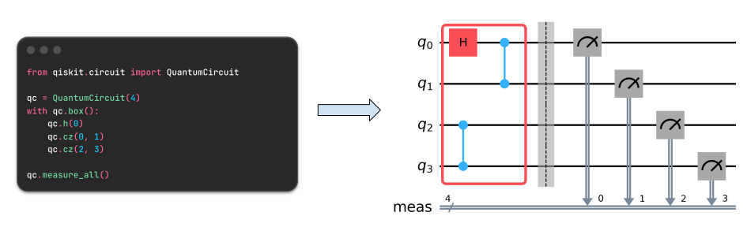

Handling quantum noise is one of the challenging task while working with NISQ-era quantum computers. Quantum noise channels are contextual by nature. Meaning, running operations on separate qubits at the same time can produce noise that doesn't match what you'd predict from each operation alone. And even when two operations on the same qubits commute perfectly, their noise may not. Simply changing the order can lead to a completely different error profile. It makes learning general noise channels and mitigating the errors highly expensive beyond a certain number of qubits [1]. Different methods exist to transform the complex noise channels into simple and manageable ones. One prominent method being Pauli Twirling which is a specialized version of Randomized Compiling [2]. 

Pauli Twirling [3] introduces random Pauli operations before and after target operation, without altering its logic. It reshapes any quantum channel into a Pauli channel, thereby converting coherent errors into Pauli (stochastic) errors. Coherent errors accumulate quadratically with circuit depth, whereas Pauli errors accumulate only linearly — making Pauli twirling an effective noise suppression technique even when used alone. It also enables the representation of noise channels using Pauli-Lindblad noise model.  The model is formulated as a Lindblad master equation, with jump operators chosen as low-weight Pauli operators acting on neighboring qubits. Representing the noise-profile in the Pauli-Lindblad model is advantageous because it provides an implicit representation of inverted noise channel. Error mitigation strategies such as Probabilistic-Error cancellation exploits inverted noise channels to reduce the error.

  <!-- Pauli errors scale linearly, whereas coherent errors scale quadratically, making Pauli twirling an noise suppression method when used alone.  -->

Sampling randomized quantum circuits is an important part of twirling based methods and Qiskit enables users to perform these randomization. In Qiskit's `SamplerV2` and `EstimatorV2` primitives, inputs to randomizations are controlled specifying `TwirlingOptions`. However, the options specified are applied globally to the circuit and users have very little control on the final randomized circuit. This may curtail the performance as it offers limited support to handle the contextuality of the noise channels. Some primitives like `NoiseLearner`, takes care of contextuality to certain extent by learning the noise layerwise. That is, different layers would have different noise profiles and all the operations within a layer to share same noise context.  

Samplomatic and the Executor primitive represent the next step in the evolution of twirling-based methods. Samplomatic is a Python library designed to handle complex, customized sampling and randomization of quantum circuits. The Executor primitive handles the implementation of customized randomizations in the quantum computers as directed by the user. Together, they give users a much more granular control over designing and executing twirling based experiments.

Boxes and Annotations are central Qiskit features that samplomatic exploits to enable thes customized randomizations. Boxes are control-flow constructs (similar to `if_test`) which can be added to the circuit without an explicit condition. They group set of gate operations and their contents behave somewhat as if the start and end of the box were barriers. However, unlike barriers, a box is permeable, allowing external operations to commute through it provided they commute with all internal instructions.


Annotations are the framework used to attach metadata to Box operations within quantum circuit and `DAGCircuit`. This metadata could be tracked and consumed by arbitrary transpiler passes including the custom ones. Intuitively, annotations are similar to the `PropertySet` which is a dictionary-like object in Qiskit. It stores the properties of `DAGCircuit` and could be accessed by all transpiler passes during transpilation. Compared to the `PropertySet`, the scope of `Annotations` are local, meaning only applied to a box of instructions.

```python
from qiskit.circuit import QuantumCircuit, Annotation

class MyAnnotation(Annotation):
    namespace = "my.namespace"

qc = QuantumCircuit(4)
with qc.box([MyAnnotation()]):
    qc.h(0)
    qc.cz(0, 1)
    qc.cz(2, 3)

qc.measure_all()
```

Samplomatic uses boxes (`BoxOp`) to group of operations that should be treated as having stable noise context. Using annotations, users can assign a specific twirling strategy to each box, giving each region of the circuit its own noise handling intent.  This better enable the users i

```python
from qiskit.circuit import QuantumCircuit
from samplomatic import Twirl

# bell-circuit
qc = QuantumCircuit(2,2)
with qc.box(annotations=[Twirl()]):
    qc.h(0)
    qc.cz(0,1)

with qc.box(annotations=[Twirl()]):
    qc.measure(range(2),range(2))
```

Beyond Pauli Twirling, samplomatic also supports other types of tasks such as noise injection, noise model learning and basis change - all performed within scope of a box. Each box is annotated with the appropriate directive for the intended task. The key directives currently supported are:

- `Twirl` - Directive to twirl the contents of a `box` instruction.
- `ChangeBasis` - Directive to add basis changing gates.
- `InjectNoise` - Directive to inject noise into a `box` instruction.

Samplomatic also provides functionalities to further configure the directives. Thus in short, boxes group the operations and the tasks to be performed within that scope are declared and configured via annotations.


**References**

[1] Probabilistic error cancellation with sparse Pauli-Lindblad noise models - [Comments](https://communities.springernature.com/posts/probabilistic-error-cancellation-with-sparse-pauli-lindblad-noise-models#comments).

[2] [Noise tailoring for scalable quantum computation via randomized compiling](https://journals.aps.org/pra/abstract/10.1103/PhysRevA.94.052325).

[3] [A tutorial on tailoring quantum noise](https://www.zlatko-minev.com/blog/twirling).