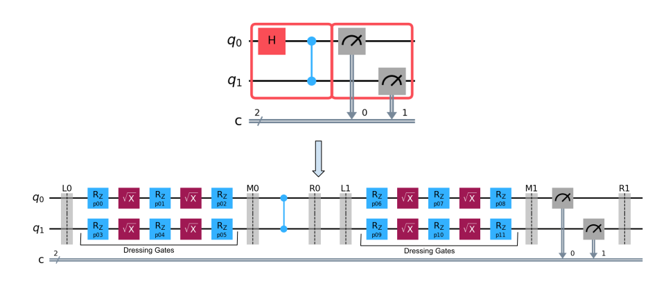

Consider a Bell circuit to which we want to apply twirling on the two-qubit operation and measurement.

```python
from qiskit.circuit import QuantumCircuit
from samplomatic import Twirl, build

# Bell circuit
qc = QuantumCircuit(2, 2)
with qc.box(annotations=[Twirl()]):
    qc.h(0)
    qc.cz(0, 1)

with qc.box(annotations=[Twirl()]):
    qc.measure(range(2), range(2))
```

The boxed circuit above does not yet perform the randomization required to enact twirling. It is instead a **declarative model** of the intended randomizations. Samplomatic uses the `build()` method to convert this declarative model into a procedural representation of twirling.

```python
template_circuit, samplex = build(qc)
```
The method returns a two-tuple consisting of a quantum circuit and a Python object called a `Samplex`.

### Template Circuit

The quantum circuit returned by `build()` is called the **Template Circuit**. It is a parameterized quantum circuit that keeps the essential structure intact:

- Two-qubit gates like cz remain unchanged.
- Measurements are preserved.

However, single-qubit gates are replaced with **dressing** (or dressing gates) which is key to enabling flexible randomization.

<!--  -->

<figure>
    
     <figcaption style="text-align: center; font-weight: bold;">
        Fig 1: Comparing boxed up circuit with Template circuit.
    </figcaption>
</figure>

A dressing is a fixed sequence of single-qubit operations (e.g., `Rz` followed by either `SX` or `RX`) whose continuous parameters can be tuned to realize any single-qubit unitary. Dressing gates serve two purposes:

- To implement the gates required by the directive (e.g., `Twirl`, `ChangeBasis`).
- To implement the single-qubit operations present in the original boxed circuit. (e.g., Hadamard gates is Bell circuit).

By default, dressing gates are composed of `Rz` and `SX` gates and are inserted to the left of the box. Samplomatic also allows users to customize the dressing type and position directly within the directive:

```python
Twirl(decomposition="rzrx", dressing="left")
```

### Samplex

The parameters required by the dressing gates are supplied by the **Samplex** which is a core type in Samplomatic. It represents a probability distribution over the parameter values needed to execute template circuits, along with classical quantities used in post-processing.

For the Bell circuit example, parameters for the template circuit can be sampled as follows:

```python
inputs = {}
outputs = samplex.sample(inputs, num_randomizations=10)
```

This returns a collection of arrays that are used during the execution of the template circuit.

For the Samplex to produce outputs, all required input values must be bound beforehand. In the Bell circuit case, no inputs are needed. However, inputs may arise when:

- The original circuit is **parametric**.
- The dressing encodes **Pauli–Lindblad maps** for noise injection.
- A **basis change array** is specified.

The inputs and outputs of a Samplex are **strongly typed**: for any given Samplex instance, their names, types, and shapes are fixed and can be queried before any sampling is performed. The easiest way to inspect the required inputs and expected outputs is to print the Samplex object directly.

```python
print(samplex)
```

This gives a structured summary of everything the Samplex expects and produces. However, what exactly does that output mean, and how does Samplex decide what to sample? Understanding Samplex is key to know how Samplomatic performs the randomizations.

**References**

[1] [Dressed boxes guides](https://qiskit.github.io/samplomatic/guides/dressed_boxes.html)

[2] [Samplex inputs and outputs guides](https://qiskit.github.io/samplomatic/guides/samplex_io.html)