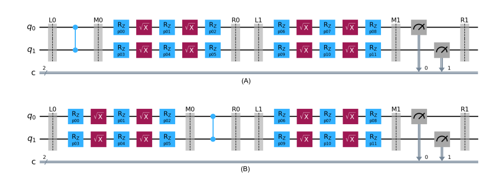

In the previous blogs, we discussed dressings and how Samplomatic uses them to implement randomisations. Users can choose the dressing type and position when annotating a box with a directive. However, as a wise man once said, with great power comes great responsibility. Inconsistent dressing during annotations can lead to errors when building the samplex, and hence the whole randomisation.

For instance, consider the following code for twirling the Bell circuit. 

```python
from qiskit.circuit import QuantumCircuit
from samplomatic import Twirl, build

# Bell circuit
qc = QuantumCircuit(2, 2)
with qc.box(annotations=[Twirl(dressing='right')]):
    qc.h(0)
    qc.cz(0, 1)

with qc.box(annotations=[Twirl()]):
    qc.measure(range(2), range(2))

template_circuit, samplex = build(qc)
```

This code will raise a `SamplexBuildError` with the message: `Found an emission without a collector on subsystems {(0,), (1,)}`. Unlike the previous example, this code uses right dressing instead of left to twirl the two-qubit gates.

<figure>
    
     <figcaption style="text-align: center; font-weight: bold;">
        Fig 1: Comparison between (A) Left dressed (B) Right dressed template circuit for the Bell circuit.
    </figcaption>
</figure>

In a right-dressed circuit, the sampling event occurs on the left side of the box. The virtual layers are generated at `L0` of the template circuit and propagates both left and right. However, the gates emitted to the left will not find any dressing to implement them. The samplomatic can build randomization procedurally only if the virtual gates can be composed into a dressing [1]. Thus, causing error in building Samplex in our case. 

Here are a few things to keep in mind when annotating circuits to avoid dressing issues [2].

- Prefer left-dressing all your boxes.
- Place any single-qubit gate in the nearest subsequent box. This minimises the depth of the resulting template_circuit. Do not place it in a previous box.
- If you do not plan on twirling the measurements, or if your circuit ends with unmeasured qubits, end with a right-dressed box. It will collect every virtual gate that has not found a collector.


### Boxing Passmanager

Samplomatic also offers a built-in pass manager to automate the annotation and boxing of circuits. It can be defined as follows:

```python
from samplomatic.transpiler import generate_boxing_pass_manager

boxing_pass_manager = generate_boxing_pass_manager(
    enable_gates = True,
    enabele_measures = True,
)
```
By enabling gates and measures, the pass manager identifies homogeneous layers of two-qubit gates and measurements in the abstract circuit. All two-qubit gate and measurement boxes returned will have left-dressed annotations. Two-qubit gate boxes are twirled automatically. For measurement boxes, users can choose between twirling, basis transform, or both [3].


In the Bell circuit example, the pass manager can be used as follows:
<!-- 
This would define a pass manager that would automatically take care about the twirling of two-qubit gates and measurements. Using the boxing pass manager we could twirl the bell circuit as follows, -->

```python
from samplomatic.transpiler import generate_boxing_pass_manager
from qiskit.circuit import QuantumCircuit
from samplomatic import Twirl, build

# Bell circuit
qc = QuantumCircuit(2, 2)
qc.h(0)
qc.cz(0, 1)
qc.measure(range(2), range(2))

# Define the pass manager for twirling gates and measures
boxing_pass_manager = generate_boxing_pass_manager(
    enable_gates = True,
    enabele_measures = True,
)

tqc = boxing_pass_manager.run(qc)

template_circuit, samplex = build(tqc)
```
Internally, the boxing pass manager runs two passes: `GroupGatesIntoBoxes` and `AbsorbSingleQubitGates`.

`GroupGatesIntoBoxes` traverses the DAG in topological order. It identifies two-qubit gates and places them in the earliest possible group, ensuring homogeneous layers share the same box. Single-qubit gates are left untouched by this pass.

`AbsorbSingleQubitGates` handles the single-qubit gates. It places them in the right-most box that can accommodate them.

Users can tune the boxing strategy of the pass manager by introducing barriers. It act as delimiting instructions. By default, the pass manager respect the barriers and places two qubit gates seperated by a barrier into two different boxes. However, it would allows the single qubit gates to premeate across the barriers, ensuring that they are accomodated in the right-most box available. This behaviour also can be altered by tuning the stratergy to handle barriers [3]. 

We will end this blog by discussing the advised usage pattern of the boxing pass manager. The workflow is as follows:

1. Build your logical circuit with barriers at positions where you want the box boundaries to be.

2. Transpile the circuit to ISA using Qiskit's native transpiler.

3. Run `generate_boxing_pass_manager()` on the ISA circuit.

In the Bell circuit example, code will be as follows:

```python
from qiskit.circuit import QuantumCircuit
from qiskit.transpiler import generate_preset_pass_manager
from samplomatic import Twirl, build
from samplomatic.transpiler import generate_boxing_pass_manager


# Bell circuit
qc = QuantumCircuit(2, 2)
qc.h(0)
qc.cz(0, 1)
qc.measure(range(2), range(2))

# Qiskit native transpiler
pm = generate_preset_passmanager(
    basis_gates=["rz", "sx", "cx"],
    coupling_map=[[0, 1]],
    optimization_level=0,
)

# Define the pass manager for twirling gates and measures
boxing_pass_manager = generate_boxing_pass_manager(
    enable_gates = True,
    enabele_measures = True,
)
pm.post_scheduling = boxing_pass_manager

tqc = pm.run(qc)

template_circuit, samplex = build(tqc)
```

This produces an ISA circuit and a Samplex, which can be used to implement randomisations on a quantum computer. But wait — so far, we have only discussed how to design a randomisation experiment. Actually _running_ it is a different story. Existing primitives such as SamplerV2 and EstimatorV2 cannot accept a Samplex as input. In the next blog, we will introduce the new `Executor` primitive and explore how to submit the template_circuit and Samplex as a `QuantumProgram` to the backend.


**References**

[1] [Dressed Boxes Tutorial](https://qiskit.github.io/samplomatic/guides/dressed_boxes.html)

[2] [Hello World Samplomatic Tutorial](https://github.com/qiskit-community/qdc-challenges-2025/blob/main/day3_tutorials/Track_A/hello_samplomatic/Samplomatic%20-%20Hello%20World.ipynb)

[3] [Boxing Pass Manager Tutorial](https://qiskit.github.io/samplomatic/guides/transpiler.html#specify-how-to-treat-barriers)